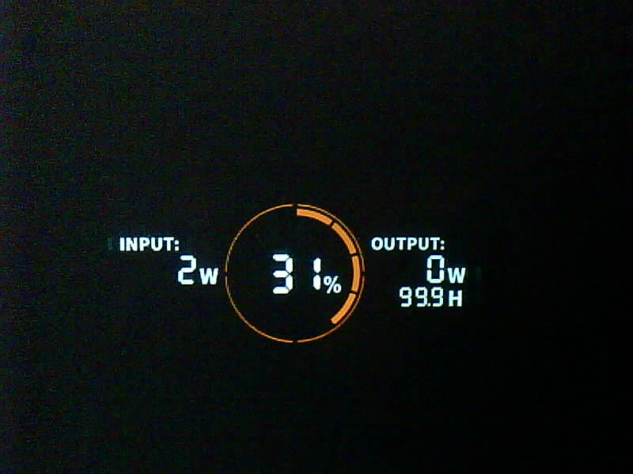
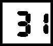
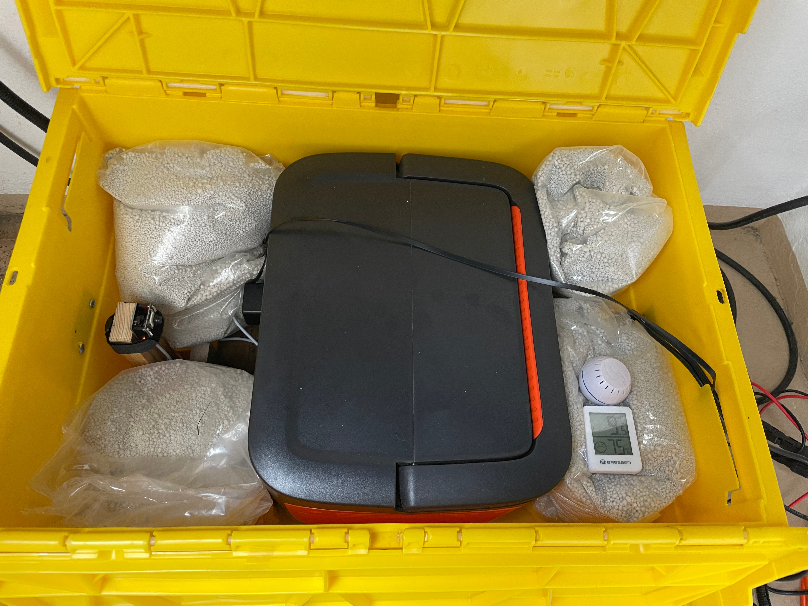
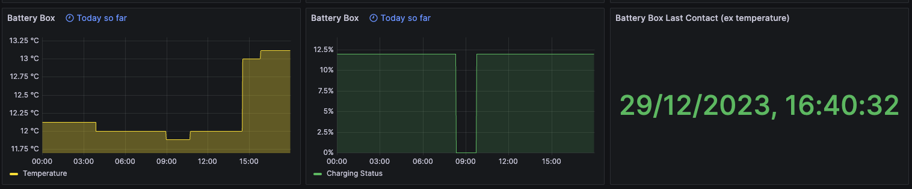

# Welcome to Jacktessery

I got my main inspiration for this project from the great work that was done for [AI-on-the-edge-device](https://github.com/jomjol/AI-on-the-edge-device). While buying ESP32 microcontrollers so that I could also read the power consumption of my flat I got a few devices which did not have the required RAM. Instead of sending them back I used them to make my [Jackery](https://www.jackery.com) portable power station "smart" (instead of buying a new one which would have app support etc.). I own a [Jackery Explorer 1000 Pro](https://de.jackery.com/products/explorer-1000-pro-portable-power-station).  

## How it works

Other than AI-on-the-edge the ESP32 here is just used to take a picture of the screen of the Jackery power station. I pretty much used this sketch from [Random Nerd Tutorials](https://randomnerdtutorials.com/esp32-cam-post-image-photo-server/) with only some minor adjustments. The ESP32 is connected to the power station but having it running continously plus having the power station's screen always on would drain too much battery, hence I also glued a [Fingerbot](https://botland.store/fingerbot-home-automation/21641-fingerbot-plus-black-adaprox-adfb0302-6973291330436.html) to the power station right on top of the button which is used to switch on the USB output. At the moment I have four (that's the maximum) schedules configured for the Fingerbot which will switch the USB output on and off twice per day. When the output is switched on the ESP32 boots up and the screen also turns on for about 2 minutes and the ESP32 can take the required pictures which are then sent onwards to a Flask based  API for which the code is hosted in this repository. Below is a sample picture taken by the ESP32 which is then further processed by the API.

One can configure the area of the picture which contains characters to be read. After the API is invoked the configured area is cropped, thresholded, inverted and a black border is added before the tesseract library is invoked to read the characters. Below is an example of an image that shows the charging status before it is read by tesseract.

All of the hardware parts including the power station are put together in a [transport box](https://transoplast.com/product/battery-box-600-x-400-x-h300-mm-yellow/) which is sitting on our balcony. I have also put pyrobubbles into the box just in case the battery should ever decide to light up. Finally I have thrown in a [Shelly H&T sensor](https://www.shelly.com/en-de/products/product-overview/shelly-h-and-t-white) so I can keep track of the temperature in the box.
Below you can see a picture of how the setup roughly looks like.  

## API Key Features

- Tesseract integation (https://pypi.org/project/pytesseract/) to read the interesting values from the power station screen
- Image processing (greystyle conversion, thresholding, cropping, erode, dilate, invert, border) to make character detection more reliable
- Validation of numbers detected (e.g. max value, max change rate ) to not expose wrong metrics
- Export of detected values as prometheus metrics
- Configuration can be adjusted via properties file
- Deployment via Docker container

## Monitoring

I am using [Grafana Lab's Free Forever](https://grafana.com/pricing/) offering to push my prometheus metrics to. I have configured a Grafana dashboard showing the metrics I am getting for the power station alongside my other smart home devices.

